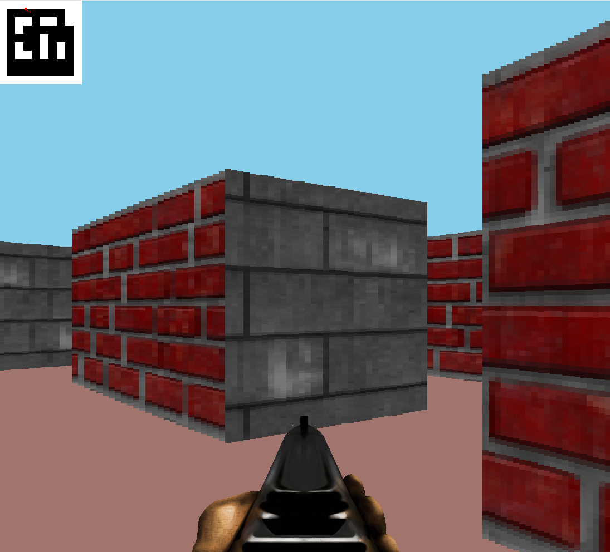

# Maze Shooter Game

## Introduction

Maze Shooter is a 3D first-person shooter game implemented in C using SDL2. Navigate through a maze, find the enemy, and shoot to win!

## Installation

### Prerequisites

- SDL2
- SDL2_image
- SDL2_mixer

Make sure you have the SDL2 development libraries installed on your system.

### Steps

1. Clone the repository:
git clone https://github.com/userrname453/raycasting_game
2. Navigate to the project directory:
cd raycasting_game
3. Compile the game using the provided Makefile:
make
## Usage
After compilation, run the game with:
./raycasting_game

- Use arrow keys to move and rotate
- Press spacebar to shoot
- Find and shoot the enemy to win the game

## Project Structure

The project uses the following structure:

- `src/`: Contains all the source (.c) files
- `header/`: Contains all the header (.h) files
- `Makefile`: Defines the compilation process

## Building

The project uses a Makefile for easy compilation. Here are some useful commands:

- `make`: Builds the executable
- `make clean`: Removes the compiled executable
